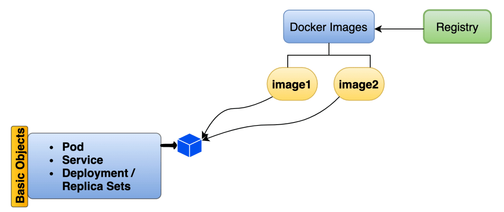

# What is POD

1. Pods are the smallest deployable units of computing that you can create and manage in Kubernetes
1. Pods lifecycle
  1. Pending
  1. Running
  1. Succeeded
  1. Failed
  1. Unknown
  1. Creating
  1. CrashLoopBackOff
1. Pods also contain shared networking and storage resources for their containers:
   1. Network: Pods are automatically assigned unique IP addresses. Pod containers share the same network namespace, including IP address and network ports. Containers in a Pod communicate with each other inside the Pod on localhost.
   1. Storage: Pods can specify a set of shared storage volumes that can be shared among the containers.
   
1. Deploy a POD to kubernetes cluster
   1. Create pod.yaml
   1. Using kubectl create pod
   1. Using kubectl check pod which is running or not
