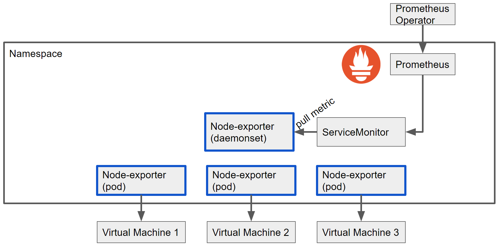

# DaemonSet
1. What is DAEMONSET
    1. A DaemonSet ensures a copy of a Pod is running across all nodes
    1. DaemonSets are used to deploy system daemons such as log collectors and monitoring agents, which typically must run on every node
1. <https://www.youtube.com/watch?v=1-tRiThpFrY&t=49s>

1. Practice Daemonset with node exporter
    ```yaml
    apiVersion: apps/v1
    kind: DaemonSet
    metadata:
      labels:
        app.kubernetes.io/component: exporter
        app.kubernetes.io/name: node-exporter
        app.kubernetes.io/part-of: kube-prometheus
        app.kubernetes.io/version: 1.1.2
      name: node-exporter
      namespace: monitoring
    spec:
      selector:
        matchLabels:
          app.kubernetes.io/component: exporter
          app.kubernetes.io/name: node-exporter
          app.kubernetes.io/part-of: kube-prometheus
      template:
        metadata:
          labels:
            app.kubernetes.io/component: exporter
            app.kubernetes.io/name: node-exporter
            app.kubernetes.io/part-of: kube-prometheus
            app.kubernetes.io/version: 1.1.2
        spec:
          containers:
          - args:
            - --web.listen-address=127.0.0.1:9100
            - --path.sysfs=/host/sys
            - --path.rootfs=/host/root
            - --no-collector.wifi
            - --no-collector.hwmon
            - --collector.filesystem.ignored-mount-points=^/(dev|proc|sys|var/lib/docker/.+|var/lib/kubelet/pods/.+)($|/)
            - --collector.netclass.ignored-devices=^(veth.*|[a-z0-9]+@if\d+)$
            - --collector.netdev.device-exclude=^(veth.*|[a-z0-9]+@if\d+)$
            image: quay.io/prometheus/node-exporter:v1.1.2
            name: node-exporter
            resources:
              limits:
                cpu: 250m
                memory: 180Mi
              requests:
                cpu: 102m
                memory: 180Mi
            volumeMounts:
            - mountPath: /host/sys
              mountPropagation: HostToContainer
              name: sys
              readOnly: true
            - mountPath: /host/root
              mountPropagation: HostToContainer
              name: root
              readOnly: true
          - args:
            - --logtostderr
            - --secure-listen-address=[$(IP)]:9100
            - --tls-cipher-suites=TLS_ECDHE_RSA_WITH_AES_128_GCM_SHA256,TLS_ECDHE_ECDSA_WITH_AES_128_GCM_SHA256,TLS_ECDHE_RSA_WITH_AES_256_GCM_SHA384,TLS_ECDHE_ECDSA_WITH_AES_256_GCM_SHA384,TLS_ECDHE_RSA_WITH_CHACHA20_POLY1305,TLS_ECDHE_ECDSA_WITH_CHACHA20_POLY1305
            - --upstream=http://127.0.0.1:9100/
            env:
            - name: IP
              valueFrom:
                fieldRef:
                  fieldPath: status.podIP
            image: quay.io/brancz/kube-rbac-proxy:v0.10.0
            name: kube-rbac-proxy
            ports:
            - containerPort: 9100
              hostPort: 9100
              name: https
            resources:
              limits:
                cpu: 20m
                memory: 40Mi
              requests:
                cpu: 10m
                memory: 20Mi
            securityContext:
              runAsGroup: 65532
              runAsNonRoot: true
              runAsUser: 65532
          hostNetwork: true
          hostPID: true
          nodeSelector:
            kubernetes.io/os: linux
          securityContext:
            runAsNonRoot: true
            runAsUser: 65534
          serviceAccountName: node-exporter
          tolerations:
          - operator: Exists
          volumes:
          - hostPath:
              path: /sys
            name: sys
          - hostPath:
              path: /
            name: root
      updateStrategy:
        rollingUpdate:
          maxUnavailable: 10%
        type: RollingUpdate
    ```
